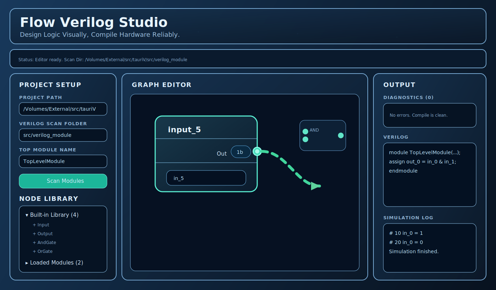

# Flow Verilog Studio

Flow Verilog Studio is a visual Verilog programming tool built with `Tauri + React + Rete.js`.
It lets you design logic with nodes, compile through an IR/pass pipeline, and run simulation from the desktop app.

## Demo UI



## Key Features

- Visual node editor for logic design
- Two-level node library: Built-in Library + Loaded Modules
- Project path and scan folder controls for Verilog module discovery
- Unified compile pipeline (`Rete Graph -> IR -> Passes -> Verilog`)
- Diagnostics panel for compile feedback
- Save and load graph (`.flowgraph.json`)
- Run Verilog simulation via Tauri adapter

## Architecture

- UI Editing Layer: `Rete` graph editing and interactions
- Compiler Core Layer: IR and pass pipeline (`src/core/compiler`)
- Tauri Adapter Layer: file scan and simulation bridge (`src/tauri-adapter`)

## Quick Start

```bash
npm install
npm run tauri dev
```

For web-only preview:

```bash
npm run dev
```

## Project Paths

- Frontend: `src/`
- Compiler core: `src/core/`
- Node definitions: `src/node/`
- Tauri backend: `src-tauri/`
- Example Verilog modules: `src/verilog_module/`
